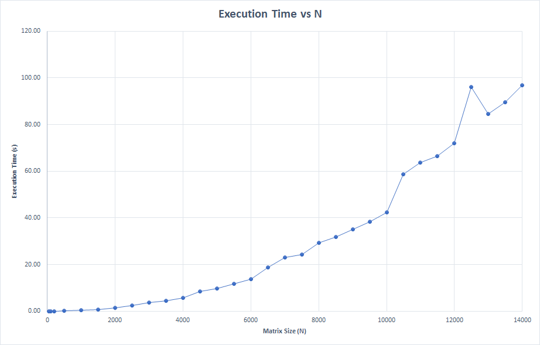

## HYPERDRIVE

## Project Review for Checkpoint
In our quest for the implementation and analysis of a high performance, fast Conjugate Gradient solver, so far we have achieved the following goals:
1. Studied the Conjugate-Gradient algorithm and experimented with the results of running the code in the available library.
2. Wrote our implementation of the algorithm in C++ and MATLAB.
3. Tested the algorithm against our custom matrix that was carefully created to be a symmetric, positive definite matrix which is a requirement for the CG algorithm to converge to acceptable results.
4. The algorithm was tested against varying sizes of the custom matrix, starting with a 50x50, all the way upto a matrix of size of 14000x14000.
5. The execution times for each of the matrices was noted and plotted to study how the algorithm behaves with increasing sizes of the matrices and determine the breakeven point, after which it would be necessary to parallelize or kernalize the algorithm to obtain results by convergence faster.
5. Once we achieved the correct implementation and execution times against our custom matrix, we tested the algorithms against available test matrices of the order of 1089 and profiled the code to obtain the regions with the most scope for parallelization.
6. After implementing the OpenMP primitives, the new execution time for the 1089x1089 test matrix was noted.

## Test Results With Custom Matrix

<!---->

<small><a href="https://millenniumfalcon418.github.io/hyperdrive/executiontimevsN">Results for our custom SPD matrix of varying dimensions</a></small>

 

## Test Results with Test Matrix of size 1089x1089
### Serial Code

| Sr. No.   |  Execution Time(s)   |
|:----------:|:------:|
|1	|189.83|

 

### With OpenMP Primitives

| Sr. No.   |      Num_threads      |  Execution Time(s) |
|:----------:|:-------------:|:------:|
|1	|2	|95.88|
|2	|4	|52.10|
|3	|8	|27.09|

 

**Thus, we observed a speedup of 6.6x of the OpenMP implementation over the serial code.**
